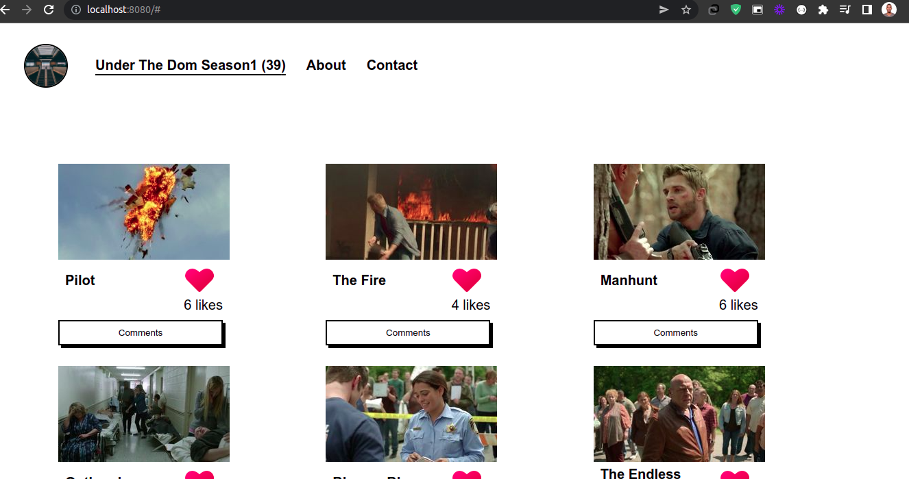

# Under The Dome TV Series - Episode list

> This project is about an app that displays the total episodes of Under The Dome TV series. All the episodes items comes from an free api and the likes and comments are performed with the use of another free api. It allows users to post comments and likes, and displays the total number of comments and likes.

## Built With:

- Html5
- CSS3
- Javascript
- Webpack
- ES6

## Screenshots



## Live Demo

- The project is deployed with [GitHub pages](https://pazzo97.github.io/TV-Shows/).

## Video Presentation

[Click Here]()


## Getting Started

To get a copyof this project you can follow these simple steps.

- run npm install

## Prerequisites
- browser (e.g. Google Chrome)
- text editor (e.g. VSCode)
- terminal/CLI

### Installation

- Copy these
    ```sh
  git clone https://github.com/Pazzo97/TV-Shows.git

- then
    ```sh
  cd TV-Shows

- open with vs code and run with live server.
- Install NPM packages
   ```sh
  npm install

### Testing

- Run
   ```sh
  npm test

## Author

👤 **Author 1**

- GitHub: [@Pazzo97](https://github.com/Pazzo97)
- LinkedIn: [@LinkedIn](https://www.linkedin.com/in/patrick-mukunzi-8389861a9/)
- Twitter: [@mukunzipat] (https://twitter.com/mukunzipat)

👤 **Author 2**

- GitHub: [@rolandfbk](https://github.com/rolandfbk)
- LinkedIn: [@LinkedIn](https://linkedin.com/in/roland-ossisa-yuma-4595547b)
- Twitter: [@rolandfbk](https://twitter.com/rolandfbk)


## 🤝 Contributing

Contributions, issues, and feature requests are welcome!

Contributions are what make the open source community such an amazing place to learn, inspire, and create. Any contributions you make are **greatly appreciated**.

If you have a suggestion that would make this better, please fork the repo and create a pull request. You can also simply open an issue with the tag "enhancement".
Don't forget to give the project a star! Thanks again!

1. Fork the Project
2. Create your Feature Branch (`git checkout -b feature/AmazingFeature`)
3. Commit your Changes (`git commit -m 'Add some AmazingFeature'`)
4. Push to the Branch (`git push origin feature/AmazingFeature`)
5. Open a Pull Request

Feel free to check the [issues page](https://github.com/Pazzo97/TV-Shows/issues).

## Show your support

Give a ⭐️ if you like this project!

## Acknowledgments

- [TvMazeAPI](https://api.tvmaze.com/shows/1/episodes - for displaying the movies episodes
- [Involvement API](https://www.notion.so/microverse/Involvement-API-869e60b5ad104603aa6db59e08150270). - for displaying the likes and comments


## 📝 License

This project is [MIT](LICENSE) licensed.